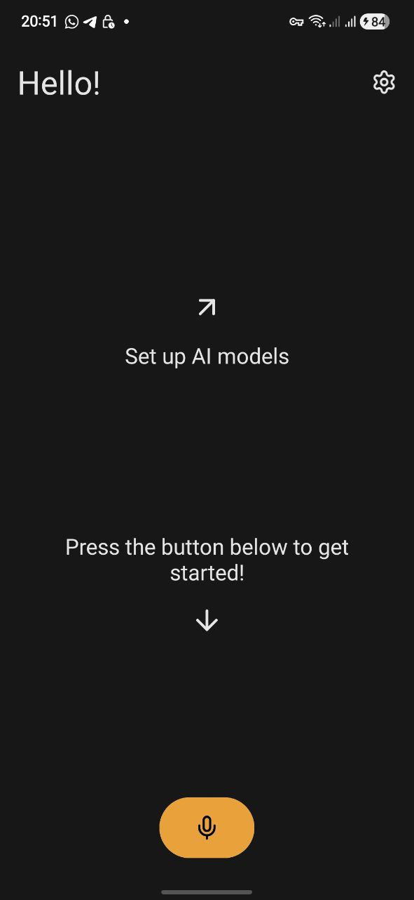
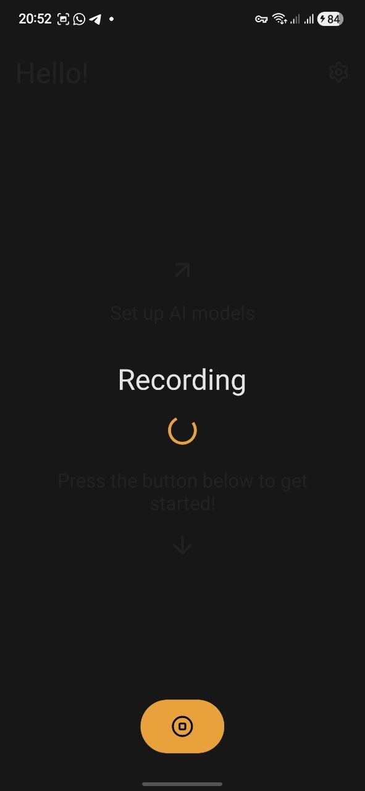
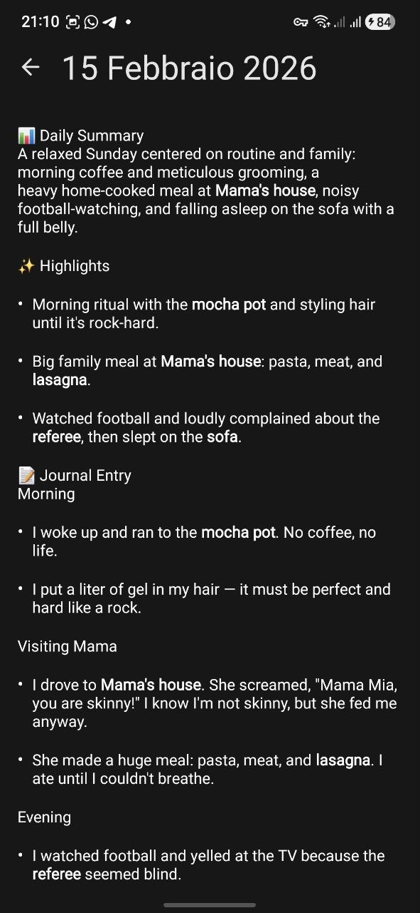
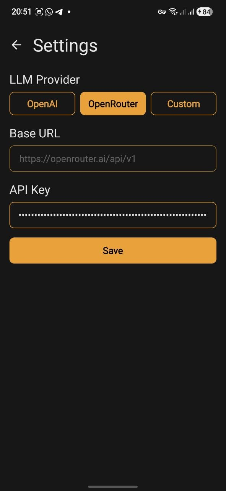

# Jurnal

Jurnal is a voice-first journaling app: record a short voice note, transcribe it locally on-device with Whisper, then enrich it with an LLM into a structured Markdown entry stored locally.

## Screenshots

|               Home               |                 Recording                  |               Note               |                 Settings                 |
| :------------------------------: | :----------------------------------------: | :------------------------------: | :--------------------------------------: |
|  |  |  |  |

## Development

### Project setup

Clone the project

```bash
git clone https://github.com/pizidavi/jurnal-app.git
```

Go to the project directory and install the dependencies

```bash
yarn install
```

### Environment setup

A `.env` file is needed to run this application.
An example `.env.sample` file can be found inside the repository.

> Note: LLM credentials are configured in-app and stored locally (MMKV). They are not read from `.env`.

### Create native files

```bash
npx expo prebuild
```

This app uses custom native code (e.g. on-device Whisper via `react-native-executorch`), so an [Expo Development Build](https://docs.expo.dev/develop/development-builds/introduction/) is required.

### Start application

```bash
yarn dev
```

## How it works (high level)

1. Record audio in-app
2. Transcribe locally using a Whisper model (via `react-native-executorch`)
3. Enrich the transcription via an LLM into a readable, structured Markdown note
4. Persist notes locally (SQLite via Drizzle)

## License

This project is licensed under the GNU General Public License v3.0 - see the [LICENSE](LICENSE) file for details.
